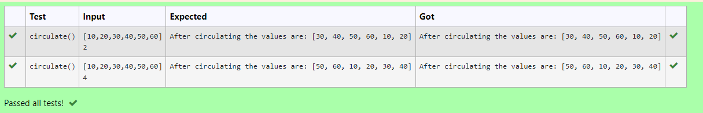

# Circulate-the-values-of-N-variables
## AIM:
To write a python program to circulate the n variables using function concept
## Equipment’s required:
PC
Anaconda - Python 3.7
## ALGORITHM: 
### Step 1: 
import def circulate
### Step 2: 
prepare the lists from each linear equations and assign in np.array()
### Step 3: 
Get the value from the user for the number of rotation
### Step 4: 
Using the slicing concept rotate the list

### Step 5: 
add coding to input value
### Step 6: 
print the coding to get answer
## PROGRAM:
```python
### Program to circulate N values.
### Developed by: Tejaswini G
### RegisterNumber:22004187
a=eval(input())
n=int(input())
a=a[n:]+a[:n]
print("After circulating the values are:",a)
```
## OUTPUT:



## RESULT:
Thus the circulation of values of N variables are successfully executed.
